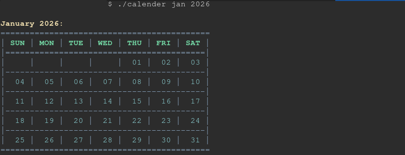
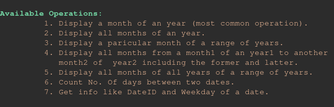

# Calender 📅
Simple Program to display Calender of months and related things related to calenders and dates.
Please check out the '**-h**' flag while running the program to learn to use it. 
`./calender -h`

I also Have a file named '**How_Does_This_Work.txt**'. It explains the logic I used 
to make this program.

---

### A minimal example would look like:

The above example displays a single month of an year

### There are also many other Operations:

## Thank You
For checking out this repo and code and reading till this 😄.

Remember the '**-h**' flag is your best friend. This README is minimal and 
that explains a lot on how to use this .
